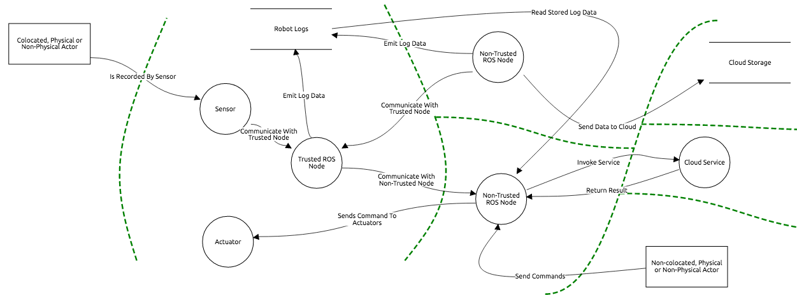
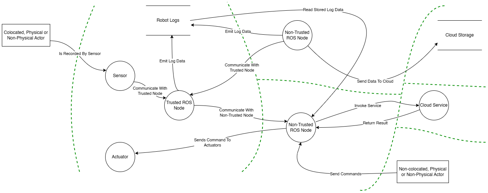

# drawio_git_testing

---

## Background and reference diagram

I have used Lucidchart for several years to create diagrams.
I dislike its closed system, where I need to access source data through their web appliaciton.
Source diagram files are dissociated from the documentation that they are supposed to help convey, whether this is a GitHub repository, or a OneDrive + Word directory.
draw.io seems like a stable option that addresses this issue, while having the simplicity of Lucidchart.

> [!NOTE]  
> I also considered UML and SysML options.
> These are also common in systems engineering, but are not currently used at Clearpath Robotics.
> draw.io does not have the model simulation capabilities, but these are not necessary for most of my diagramming requirements.

> [!NOTE]  
> I also considered Microsoft Visio.
> Visio has the simple diagramming functionality that I need.
> The downsides of Visio are that the source files are binaries which are not great for git, and Visio is a paid program.
> Rockwell Auotmation employees have access to Visio, but our customers interacting with docs.clearpathrobotics.com may not have Visio.

I have seen lots of example threat model diagrams created using draw.io and Threat Dragon.
Both of these create source text files that can be version controlled with git. 
I will be using a ROS 2 threat model from [this page](https://design.ros2.org/articles/ros2_threat_model.html) as a reference.
The diagram was created with Threat Dragon.
I intend to recreate it by hand using draw.io.
I am using the Windows native application of draw.io.
There is also a cloud + GitHub integration of draw.io, but I am not testing it.

  <table>
    <tr>
      <td></td>
      <td></td>
    </tr>
    <tr>
      <td>Reference image, created with Threat Dragon</td>
      <td>My replica image, created with draw.io</td>
    </tr>
  </table>

---

##  Notes about drawio and git

* draw.io has a shape library called `Threat Modeling` which has all the forms shown in the reference diagram.
* There is a `Bezier` checkbox within a line's `Properties`. 
  This produced a form similar to the reference Dragon Threat Model.
* draw.io includes layers.
* Curved-line + Curved-waypoints do not snap radially to circular shapes.
  Curved-line + Straight-waypoints resolve this.
* The built in `Trust Boundary` shape had odd end points that made the diagram more confusing.
  Using lines on a separate layer achieved a better result. 
* When exporting a PNG, the export dialog includes a `Border` field to add padding around the image.
* There are check boxes in the `Layers` panel.
  Check all of these if you want to select + move all objects.
